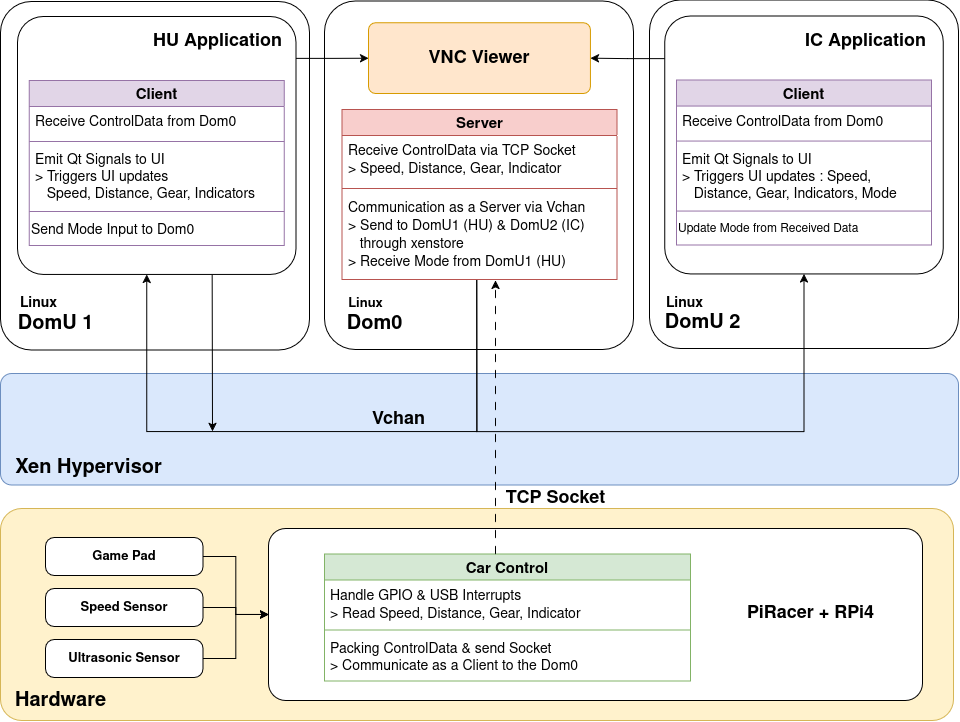

# Hypervisor - SCS:Integrated Digital Cockpit

## **Introduction**

This project focuses on developing an integrated digital cockpit system based on the Xen hypervisor. By leveraging virtualization, the system consolidates multiple automotive functions—such as Instrument cluster, Head unit—onto a single hardware platform. The use of a hypervisor ensures robust isolation, security, and resource efficiency, aiming to enhance both the user experience and system reliability in next-generation vehicles. [Here is the detailed explanation of this project](https://github.com/SEA-ME/SCS_Integrated_Digital_Cockpit)

---

## **Overview**

[_talkv_wxUWTSja2o_ov7sr1G0Ysbrc6PVkcjEJ1_talkv_high.mp4](files/_talkv_wxUWTSja2o_ov7sr1G0Ysbrc6PVkcjEJ1_talkv_high.mp4)

The Xen hypervisor is an open-source, type-1 hypervisor that enables multiple independent operating systems(domains) to run concurrently on a single hardware system. This architecture allows each domain to be strictly isolated, significantly improving both safety and security.



Key features of Hypervisor-Based Architecture

- Domain Isolation: Safety-critical and non-safety functions are logically separated, ensuring that faults in one domain do not affect others
- Resource Efficiency: Hardware resources are dynamically allocated and managed for maximum system efficiency

---

## Project Description

### XEN Project
- **Type-1 Hypervisor**: Runs directly on the hardware (bare metal), not on top of an operating system.
- **Dom0**: The first domain (privileged), responsible for managing hardware and creating other guest domains.
- **DomU**: Unprivileged guest domains running user operating systems.
- **Virtualization Types**: Supports Paravirtualization (PV), Hardware-assisted Virtualization (HVM), and PVH (hybrid).

### Detailed about the Project
- **Dom0**: Controls the PiRacer hardware and accesses the physical display via VNC.
- **DomU1 (HU)**: Runs the **Head Unit** Qt application.
- **DomU2 (IC)**: Runs the **Instrument Cluster** Qt application.


### Enabling Xen Hypervisor on Yocto

To enable **Xen** in your Yocto-based image, follow these steps:

### 1. Add `meta-virtualization` Layer

Ensure you have the `meta-virtualization` layer in your Yocto workspace. Add it to your `bblayers.conf`:

```bash
BBLAYERS += "/path/to/meta-virtualization"
```
### 2. Enable Xen in local.conf
Append Xen-related features to your distro:

```bash
DISTRO_FEATURES:append = " virtualization xen"
```
`Note: Tigervnc cannot be used with Wayland, as it is based on X11.`

### Configuring Dom0 and DomU for Xen
To run Xen properly, both Dom0 and DomU kernels must be configured with Xen-compatible options.

#### Dom0 Kernel Configuration
Dom0 must support Xen backend drivers and hypervisor communication features. Make sure the following kernel options are enabled:

- CONFIG_XEN_DOM0
- CONFIG_XEN

- CONFIG_BRIDGE
- CONFIG_PHY_BROADCOM

- CONFIG_XEN_BLKDEV_BACKEND

- CONFIG_XEN_GNTDEV

- CONFIG_XEN_DEV_EVTCHN

#### DomU Kernel Configuration
DomU images require frontend drivers and PVH support:

- CONFIG_XEN
- CONFIG_XEN_NETDEV_FRONTEND

- CONFIG_XEN_BLKDEV_FRONTEND

- CONFIG_HVC_XEN

- CONFIG_PARAVIRT

- CONFIG_XEN_PVH 

### Creating a DomU (Guest) Domain
To launch a DomU domain, create a configuration file like the following:

Belowed code is `domic.cfg` 
```bash
kernel = "/home/root/IcImage"
cmdline = "console=hvc0 earlyprintk=xen sync_console root=/dev/xvda"
memory = "512"
name = "ic"
vcpus = 1
serial = "pty"
disk = [ 'file:/home/root/IC.ext3,xvda,w' ]
vif = [ 'mac=00:11:22:66:88:33,bridge=natbr0' ]
```
Replace IcImage with your custom kernel image and IC.ext3 with your root filesystem.

Then launch the domain from Dom0 using:

```bash
xl create -c ic.cfg
```
Make sure both the kernel image and the root filesystem (ext3) exist on the Dom0 filesystem before running this command.


---

### VNC

---

### Vchan Communication

Vchan is a communication mechanism in Xen environments that enables high speed, low latency inter-domain communication. It’s built on shared memory and event channels, using grant tables to securely grant memory access between domains.

**Why we using vchan?**

It is lightweight, no extra daemons or protocols are needed and it’s fully integrated into the Xen ecosystem. Based on these advantages, we chose vchan as an alternative to conventional communication protocols like CAN and VSOME/IP.

**vchan communication structure**

- Grant table: allow a domain to securely share memory pages with another domain by storing access permissions.
- Event channel: provides interrupt-based signal for real-time responsiveness during data transmission.
- Xenstore: manages communication channel setup and shared memory information between domains.

---

## Tech Stack

---

## Contributors

<center>
<table align="center">
<tr>
<td align="center">
<a href="https://github.com/iznue">

<br />
<sub><b>Eunji Lee</b></sub>
</a>
<br />
<a href="https://github.com/iznue"></a>
<br />
</td>
<td align="center">
<a href="https://github.com/programerKim">

<br />
<sub><b>Seungjoo Kim</b></sub>
</a>
<br />
<a href="https://github.com/programerKim"></a>
<br />
</td>
<td align="center">
<a href="https://github.com/mechsoon">

<br />
<sub><b>Soonwoong Kim</b></sub>
</a>
<br />
<a href="https://github.com/mechsoon"></a>
<br />
</td>
</tr>
</table>
</center>